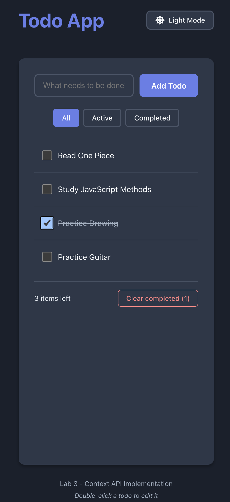

# Lab 3: Context API Implementation - Todo App

A fully-featured Todo application demonstrating React's Context API for global state management. This project implements three independent contexts to manage todos, filters, and theming with full TypeScript support and localStorage persistence.



**Live Demo:** https://con-api.netlify.app/

## Project Overview

This application showcases professional patterns for using React Context API to manage global state across a complex application. Built with React, TypeScript, and Vite.

## Features

### Core Functionality
- ✓ Add new todos
- ✓ Toggle todo completion
- ✓ Delete todos
- ✓ Edit todos (double-click to edit)
- ✓ Clear all completed todos
- ✓ Filter todos (All, Active, Completed)
- ✓ Light/Dark theme toggle
- ✓ localStorage persistence for todos and theme

### User Experience
- Double-click any todo to edit it inline
- Keyboard shortcuts (Enter to save, Escape to cancel while editing)
- Responsive design for mobile and desktop
- Smooth theme transitions
- Visual feedback for all interactions

## Architecture

### Three Independent Contexts

#### 1. TodoContext
**Purpose:** Manages todo items and operations

**State:**
- `todos`: Array of todo items (id, text, completed)

**Actions:**
- `addTodo(text)` - Add new item
- `toggleTodo(id)` - Toggle completion status
- `deleteTodo(id)` - Remove item
- `editTodo(id, newText)` - Modify text
- `clearCompleted()` - Remove all completed items

**Implementation:** Uses `useReducer` for complex state management with typed actions

#### 2. FilterContext
**Purpose:** Manages visibility filter

**State:**
- `filter`: Current filter ('all' | 'active' | 'completed')

**Actions:**
- `setFilter(filter)` - Update filter

**Implementation:** Uses `useState` for simple state

#### 3. ThemeContext
**Purpose:** Manages light/dark theme

**State:**
- `theme`: Current theme ('light' | 'dark')

**Actions:**
- `toggleTheme()` - Switch between themes

**Implementation:** Uses `useState` with localStorage persistence

### Components

**TodoInput** - Input field for adding new todos

**TodoList** - Displays filtered todos with:
- Uses `useMemo` for optimized filtering
- Shows active/completed counts
- Conditional rendering based on filter state

**TodoItem** - Individual todo with:
- Checkbox for completion toggle
- Double-click to edit
- Delete button
- Edit mode with keyboard shortcuts

**FilterButtons** - Filter selection buttons

**ThemeToggleButton** - Theme switcher

**AppProviders** - Wrapper component that composes all providers

## Project Structure

```
src/
├── contexts/
│   ├── TodoContext.tsx        # Todo state with useReducer
│   ├── FilterContext.tsx      # Filter state
│   ├── ThemeContext.tsx       # Theme state with persistence
│   └── AppProviders.tsx       # Provider composition
├── components/
│   ├── TodoInput.tsx          # Add todo form
│   ├── TodoItem.tsx           # Individual todo
│   ├── TodoList.tsx           # Todo list with filtering
│   ├── FilterButtons.tsx      # Filter controls
│   └── ThemeToggleButton.tsx  # Theme switcher
├── App.tsx                    # Main app component
└── main.tsx                   # App wrapped with providers
```

## Getting Started

### Installation
```bash
npm install
```

### Development
```bash
npm run dev
```

Visit `http://localhost:5173` to view the application.

### Build
```bash
npm run build
```

### Lint
```bash
npm run lint
```
